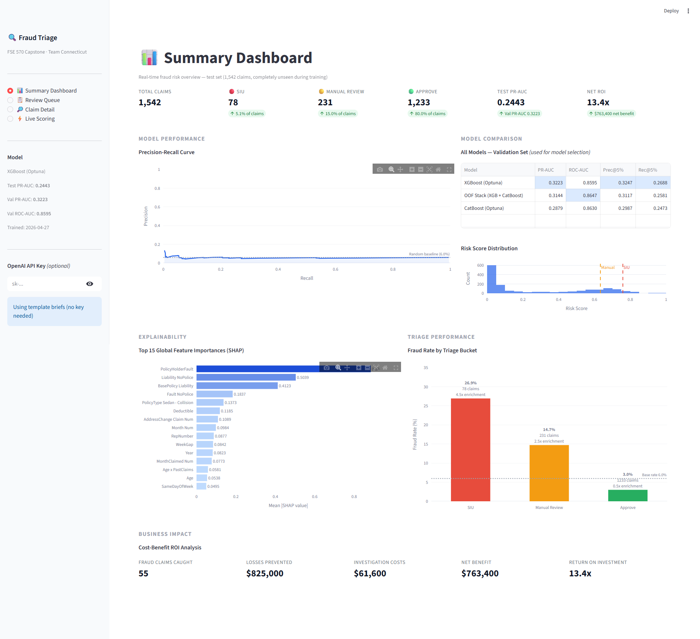
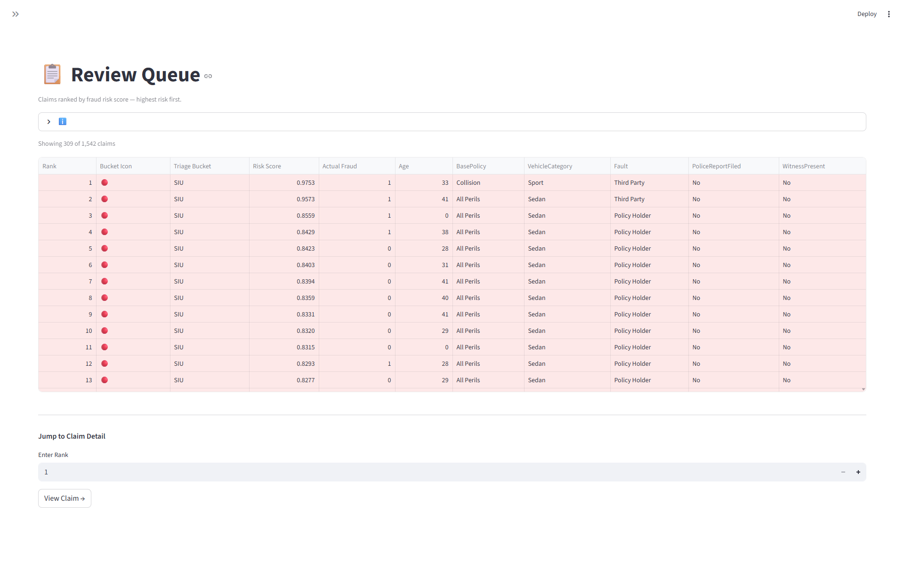
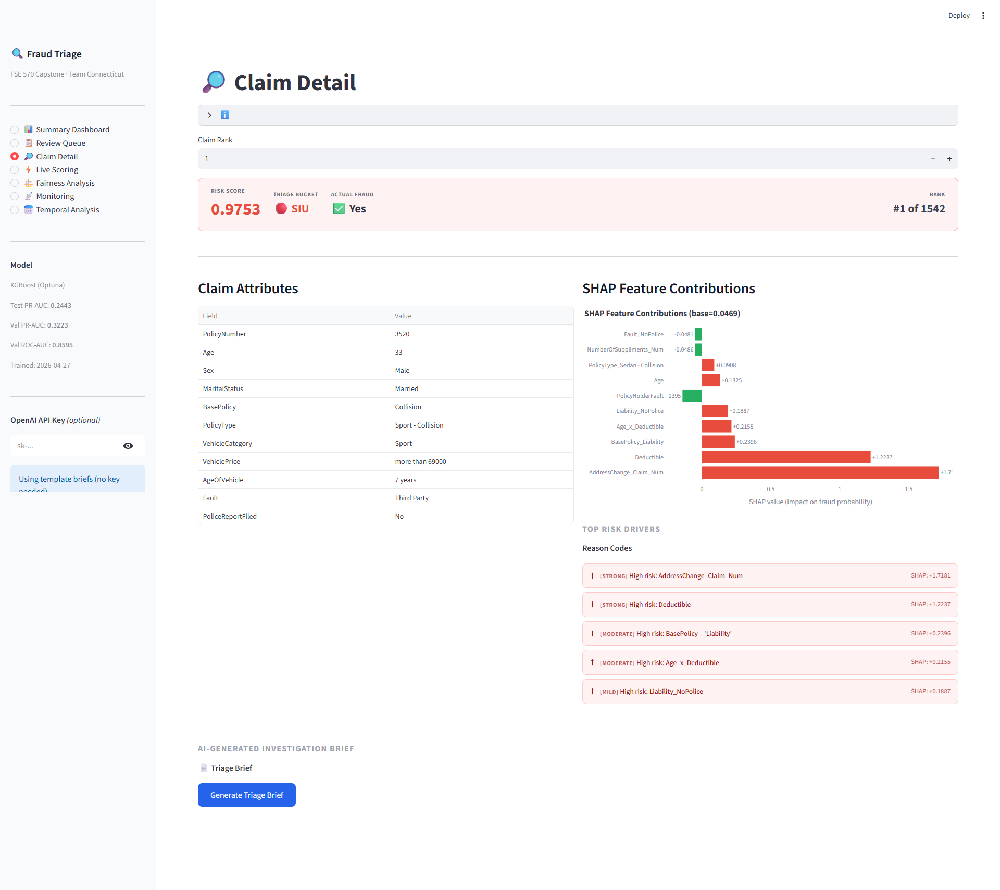
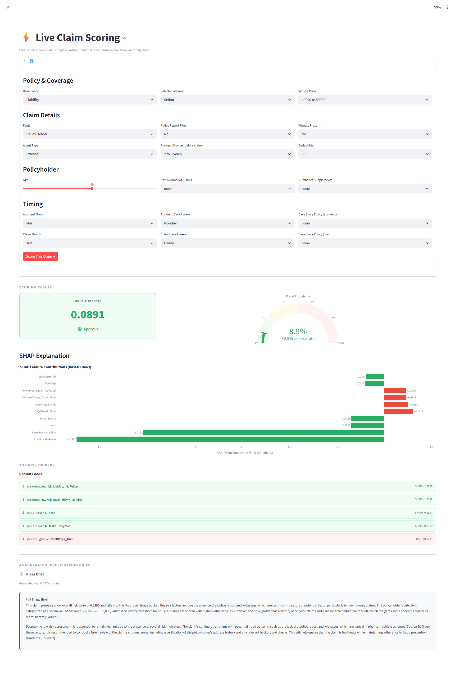
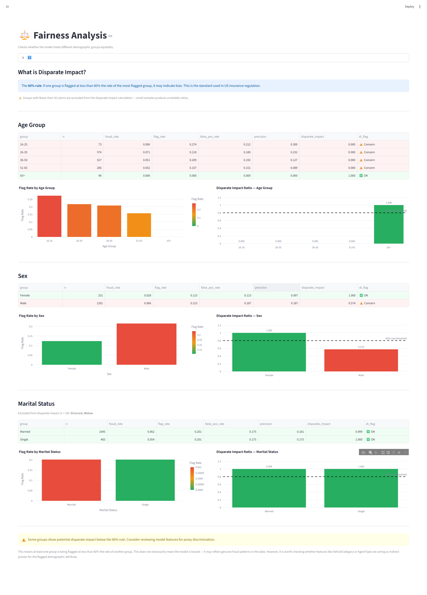
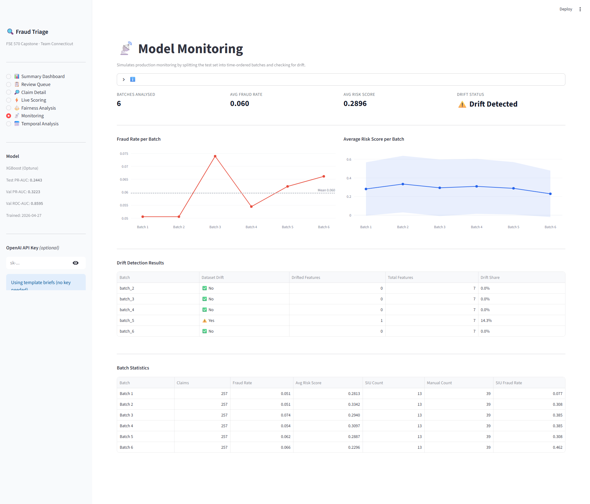
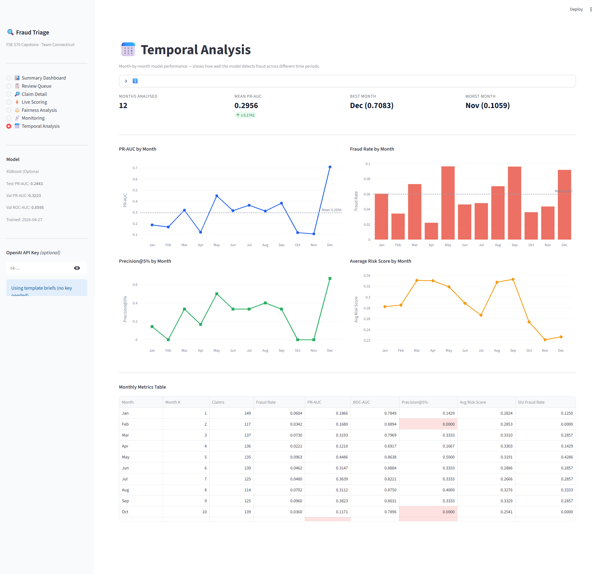
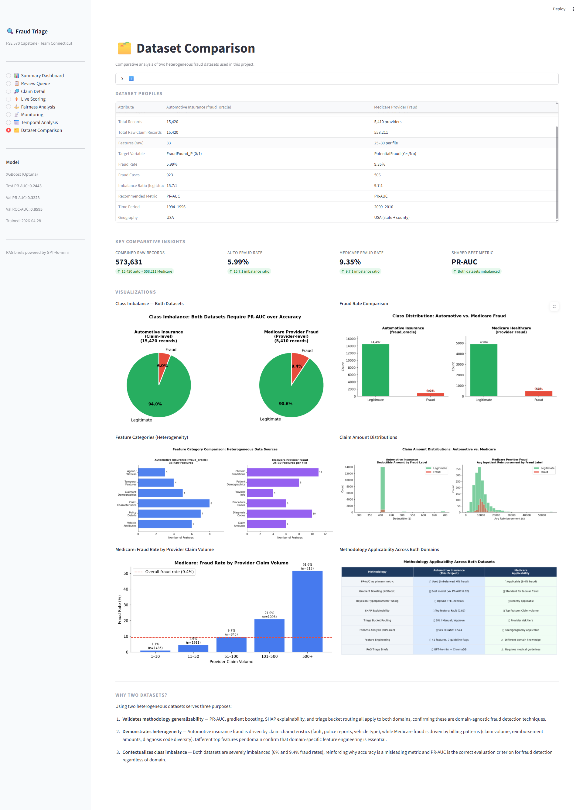
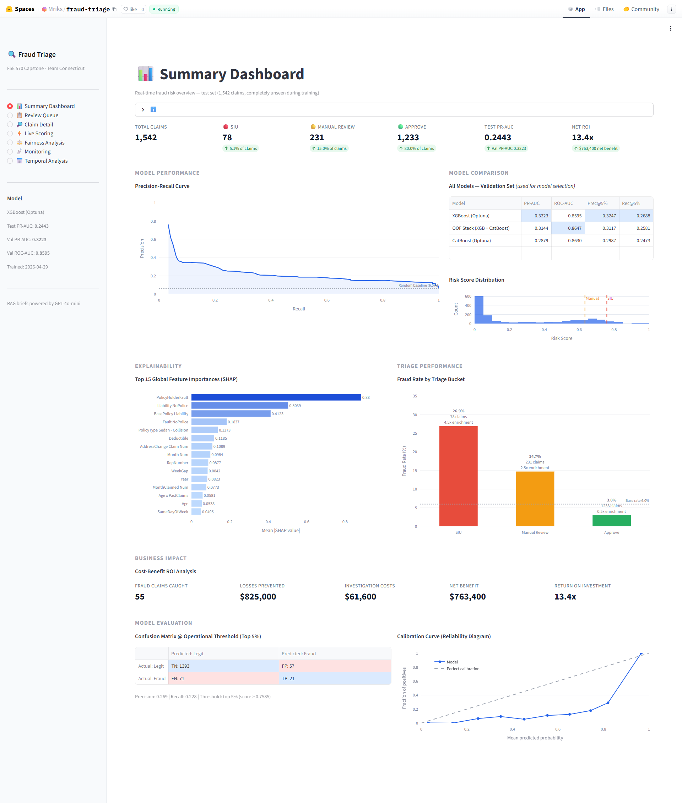

# Automotive Insurance Claims Risk Triage

> **FSE 570 Capstone Project** — Arizona State University
> **Team Connecticut:** Mriganko Chowdhury, Aryan Gonsalves, Ashish Raj Singh, Deborah Sheryl Veluvalli, Kshama Girish

🚀 **Live Demo:** [https://huggingface.co/spaces/Mriks/fraud-triage](https://huggingface.co/spaces/Mriks/fraud-triage)

> The app is hosted on Hugging Face Spaces (free tier). If it's been inactive it may take ~30 seconds to wake up on first visit.

An end-to-end fraud triage system for automotive insurance claims that:
1. **Predicts** a fraud risk score for each claim (XGBoost, CatBoost, OOF Stacking Ensemble)
2. **Explains** the key risk drivers using SHAP values and human-readable reason codes
3. **Generates** a policy-grounded triage brief using Retrieval-Augmented Generation (RAG) with citations to internal fraud guidelines
4. **Routes** each claim to the appropriate triage bucket: **SIU Escalation**, **Manual Review**, or **Approve**
5. **Analyses fairness** across demographic groups (age, sex, marital status) using the 80% disparate impact rule
6. **Monitors** for data drift by comparing chronological batches against the training distribution
7. **Tracks** per-month performance to surface seasonality (pooled across 1994–96, not a decay timeline)
8. **Visualises** everything in an interactive Streamlit dashboard with 8 pages

---

## Screenshots

| Summary Dashboard | Review Queue |
|:-:|:-:|
|  |  |

| Claim Detail + RAG Brief | Live Scoring |
|:-:|:-:|
|  |  |

| Fairness Analysis | Model Monitoring |
|:-:|:-:|
|  |  |

| Temporal Analysis |  |
|:-:|:-:|
|  |  |

| Dataset Comparison |  |
|:-:|:-:|
|  |  |

| Live on Hugging Face Spaces |  |
|:-:|:-:|
|  |  |

| MLflow Experiment Tracking |  |
|:-:|:-:|
|  |  |

---

## Table of Contents

- [Project Structure](#project-structure)
- [Quick Start](#quick-start)
- [Docker](#docker)
- [Streamlit Dashboard](#streamlit-dashboard)
- [Module Reference](#module-reference)
- [MLflow Experiment Tracking](#mlflow-experiment-tracking)
- [Tests](#tests)
- [Critical Finding: Data Leakage](#critical-finding-data-leakage)
- [Model Performance](#model-performance)
- [Model Selection and Evaluation Experiments](#model-selection-and-evaluation-experiments)
- [Dataset Comparison](#dataset-comparison)
- [Fairness Analysis](#fairness-analysis)
- [Model Monitoring](#model-monitoring)
- [Seasonality Analysis](#seasonality-analysis)
- [SHAP Explainability](#shap-explainability)
- [RAG Pipeline](#rag-pipeline)
- [Key Improvements](#key-improvements-over-original-notebook)
- [Outputs](#outputs)

---

## Project Structure

```
FSE 570 Capstone Project/
│
├── app.py                        # Streamlit dashboard (8 pages)
├── config.py                     # Shared constants, paths, hyperparameters
├── training_config.yaml          # All training settings in one YAML file
├── train.py                      # Single command runs the full pipeline
│
├── data_pipeline.py              # SINGLE source of truth: CSV → features → split → preprocessor
├── data_preprocessing.py         # Data loading, EDA, splitting, preprocessing pipeline
├── data_validation.py            # Pandera schema checks on raw data
├── feature_engineering.py        # 41 engineered features
├── modeling.py                   # LR baseline, XGBoost, LightGBM
├── model_improvement.py          # Optuna tuning + CatBoost + OOF stacking ensemble
├── shap_explainability.py        # SHAP values, global importance, per-claim reason codes
├── rag_pipeline.py               # RAG: persistent ChromaDB index + triage brief generation
│
├── fairness_analysis.py          # Disparate impact analysis (age, sex, marital status)
├── monitoring.py                 # Batch drift vs. training data (KS + Benjamini-Hochberg)
├── temporal_analysis.py          # Per-month (seasonality) performance analysis
├── medicare_comparison.py        # Medicare vs. auto insurance EDA + comparison plots
├── medicare_modeling.py          # XGBoost + Optuna pipeline on Medicare provider fraud data
│
├── api/                          # FastAPI scoring service (schemas + endpoints)
├── scripts/                      # Reproducible experiments and benchmarks
│   ├── model_bakeoff.py          # Model comparison + feature ablation (repeated CV)
│   ├── evaluate_oof.py           # Out-of-fold evaluation over all 15,420 claims
│   └── benchmark_api.py          # Serving latency: p50/p95/p99, cold start
│
├── requirements.txt              # Python dependencies
├── .env.example                  # Template for OpenAI API key
├── pytest.ini                    # Test configuration
├── Dockerfile                    # Dashboard container
├── Dockerfile.api                # Serving container (no training deps)
├── docker-compose.yml            # App + MLflow server
│
├── tests/
│   ├── test_feature_engineering.py   # 30+ feature engineering tests
│   ├── test_preprocessing.py         # Data split, preprocessor, validation tests
│   ├── test_modeling_utils.py        # Triage bucket, ROI, reason code tests
│   ├── test_monitoring.py            # Batch ordering, drift exclusions, BH correction
│   ├── test_fairness.py              # Disparate impact reference group, age binning
│   ├── test_api.py                   # Endpoints, validation, train/serve skew guard
│   └── test_rag_pipeline.py          # Chunking, query building, brief generation tests
│
├── .github/
│   └── workflows/
│       ├── deploy.yml            # Auto-deploy to Hugging Face Spaces on push
│       └── tests.yml             # Run pytest on every push
│
├── docs/
│   └── fraud_guidelines/         # Curated insurance fraud guideline documents (4 files)
│       ├── fraud_red_flags.md
│       ├── triage_procedures.md
│       ├── policy_coverage_standards.md
│       └── staged_accident_patterns.md
│
├── notebooks/
│   └── Automotive_Insurance_Claims_Risk_Triage.ipynb
│
└── outputs/
    ├── eda/                      # EDA plots and data quality summaries
    ├── plots/                    # PR curves, risk score distributions, calibration curves
    ├── metrics/                  # Model comparison tables, triage analysis, ROI summary
    ├── models/                   # Serialized base model artifacts (.joblib)
    ├── shap/                     # SHAP importance CSVs, beeswarm plots, reason codes
    ├── improvement/              # Optuna results, stacking ensemble, model_metadata.json
    ├── rag/                      # Persistent ChromaDB index + demo triage briefs
    ├── fairness/                 # Disparate impact charts and CSVs
    ├── monitoring/               # Batch statistics, drift summary, trend charts
    ├── temporal/                 # Monthly metrics CSV and performance charts
    ├── experiments/              # Model bake-off, ablation, out-of-fold evaluation
    └── serving/                  # API latency benchmark
```

---

## Quick Start

### 1. Clone the repository

```bash
git clone https://github.com/Mriks42/insurance-claims-risk-triage.git
cd insurance-claims-risk-triage
```

### 2. Install dependencies

```bash
pip install -r requirements.txt
```

### 3. Download the datasets

**Primary dataset:** Download `fraud_oracle.csv` from [Kaggle — Vehicle Insurance Fraud Detection](https://www.kaggle.com/datasets/shivamb/vehicle-claim-fraud-detection) and place it in the project root.

**Secondary dataset (optional — for Dataset Comparison page):** Download the [Healthcare Provider Fraud Detection](https://www.kaggle.com/datasets/rohitrox/healthcare-provider-fraud-detection-analysis) dataset and extract all CSV files into a `medicare_data/` folder in the project root. Then run:

```bash
python medicare_comparison.py   # EDA and comparison plots
python medicare_modeling.py     # XGBoost + Optuna model on Medicare data
```

### 4. Enable LLM-powered briefs (GPT-4o-mini)

Copy `.env.example` to `.env` and add your OpenAI API key:

```bash
# .env
OPENAI_API_KEY=sk-your-key-here
```

Get a key at [platform.openai.com](https://platform.openai.com/api-keys). GPT-4o-mini costs ~$0.0003 per brief — $5 of credits lasts essentially forever for portfolio use.

**For the live Hugging Face app:** Add `OPENAI_API_KEY` as a secret in your Space settings (Settings → Variables and secrets → New secret).

Without a key the RAG pipeline automatically falls back to the structured template mode — fully functional, no API needed.

### 5. Run the full pipeline (one command)

```bash
python train.py
```

This single command replaces running 4 scripts manually. It executes the full pipeline in order:
1. **Data validation** — Pandera schema checks on `fraud_oracle.csv`
2. **Base modeling** — LR baseline, XGBoost, LightGBM
3. **SHAP analysis** — global importance, per-claim reason codes
4. **Model improvement** — Optuna Bayesian tuning, CatBoost, OOF stacking
5. **RAG pipeline** — builds persistent ChromaDB vector index

Every step is automatically logged to MLflow. Use flags to skip steps:

```bash
python train.py --skip-base --skip-shap --skip-rag   # Optuna tuning only (fastest)
python train.py --skip-improvement --skip-rag         # base models + SHAP only
```

All settings (Optuna trials, split ratios, cost assumptions) live in `training_config.yaml` — edit that file to change any parameter without touching the code.

### 6. Launch the dashboard

```bash
python -m streamlit run app.py
```

### 7. View MLflow experiment runs

```bash
mlflow ui
# Opens at http://localhost:5000
```

### 8. Run tests

```bash
pytest tests/
```

---

## Docker

The app is fully containerized using Docker. This means anyone can run it on any machine without installing Python, managing package versions, or dealing with environment conflicts — just one command and it starts.

### Two Dockerfiles

| File | Purpose |
|------|---------|
| `Dockerfile` | Full image — includes all ML training + dashboard dependencies. Used by Hugging Face Spaces for live deployment |
| `Dockerfile.slim` | Lightweight image — dashboard-only dependencies, smaller size. Ideal for local testing when disk space is limited |

### Run with Docker Desktop

Install [Docker Desktop](https://www.docker.com/products/docker-desktop/) and run:

```bash
# Full stack — dashboard + MLflow server
docker-compose up

# Dashboard opens at http://localhost:8501
```

To also start the MLflow tracking UI:
```bash
docker-compose --profile mlflow up
# Dashboard at http://localhost:8501
# MLflow UI at http://localhost:5000
```

### Run the slim image (lower disk usage)

```bash
# Build
docker build -f Dockerfile.slim -t fraud-triage-slim .

# Run
docker run -p 8501:8501 fraud-triage-slim

# Dashboard at http://localhost:8501
```

### Why Docker matters
In production, your model runs on a server, not your laptop. Docker guarantees the server runs the exact same environment as your development machine — same Python version, same package versions, same configuration. Without Docker, "works on my machine" is a common and costly problem. Every major cloud provider (AWS, GCP, Azure) deploys applications as Docker containers.

### No Docker Desktop? Use GitHub Codespaces
If you don't have admin rights to install Docker Desktop:
1. Go to your GitHub repo
2. Click green **Code** button → **Codespaces** → **Create codespace on main**
3. Docker is pre-installed — run the same commands above directly in the browser terminal

---

## Scoring API

The model is served over HTTP independently of the dashboard, so it can be called by a claims system rather than only clicked in a browser.

```bash
uvicorn api.main:app --port 8000      # docs at http://localhost:8000/docs
docker compose up api                  # or containerised
```

| Endpoint | Purpose |
|----------|---------|
| `POST /predict` | Score one claim → risk score, triage bucket, applied defaults. `?explain=true` adds SHAP reason codes |
| `POST /predict/batch` | Score many claims in one transform pass (capped by `MAX_BATCH`, 413 above it) |
| `GET /health` | Liveness **and** whether the model artifacts actually loaded |
| `GET /model` | Version, training date, held-out PR-AUC **with its confidence interval**, bucket thresholds, cost assumptions |

```bash
curl -X POST localhost:8000/predict -H 'content-type: application/json' -d '{
  "BasePolicy":"Liability","VehicleCategory":"Sport","VehiclePrice":"more than 69000",
  "Fault":"Policy Holder","PoliceReportFiled":"No","WitnessPresent":"No",
  "AgentType":"External","AddressChange_Claim":"under 6 months","Deductible":400,
  "PastNumberOfClaims":"2 to 4","NumberOfSuppliments":"more than 5","Age":23,
  "Sex":"Male","MaritalStatus":"Single","AccidentArea":"Urban","AgeOfVehicle":"7 years",
  "Month":"Jan","DayOfWeek":"Monday","Days_Policy_Accident":"none",
  "MonthClaimed":"Jan","DayOfWeekClaimed":"Tuesday","Days_Policy_Claim":"more than 30"}'
```

### The API does not read the dataset

Training now persists the **fitted preprocessor** (`outputs/improvement/preprocessor.joblib`) and a **serving bundle** (feature order, bucket thresholds, metrics) alongside the model. Before that, anything scoring a claim re-read `fraud_oracle.csv` and re-fitted the `ColumnTransformer`, which meant serving depended on the training data being present and unchanged — a train/serve skew risk, and the reason the Hugging Face Space needed the CSV uploaded by hand.

`tests/test_api.py::TestTrainServeSkew` scores rows through HTTP and asserts the result matches the offline model to within 1e-6.

Request validation reuses the Pandera schema in `data_validation.py`, so the API's idea of a valid claim cannot drift from the pipeline's. Unknown categories, out-of-range ages and misspelled fields are 422s with the offending field named — including `Age: 0`, which appears 320 times in the training file and is a data artifact rather than an age.

### Latency

Measured in-process (full FastAPI stack, no network) via `python scripts/benchmark_api.py`, written to `outputs/serving/latency.json`:

| Scenario | p50 | p95 | p99 | Throughput |
|----------|----:|----:|----:|-----------:|
| Single claim | 28.3 ms | 31.5 ms | 35.5 ms | 35 claims/s |
| Single + SHAP explanation | 30.1 ms | 31.6 ms | 57.5 ms | 33 claims/s |
| Batch of 10 | 31.3 ms | 37.1 ms | 57.5 ms | 320 claims/s |
| Batch of 100 | 35.3 ms | 41.5 ms | 43.0 ms | **2,835 claims/s** |
| `/health` | 1.2 ms | 1.6 ms | 1.8 ms | — |

Cold start (loading model + preprocessor + bundle): **64 ms**.

**Where the time actually goes.** XGBoost inference on one row is **0.59 ms** — about 2% of a request. The rest is pandas feature engineering and the sklearn `ColumnTransformer`, whose cost is per-*call* rather than per-row, which is why 100 claims cost barely more than one and per-claim latency falls to 0.35 ms when batched.

Profiling the request path found `engineer_features()` at 72% of single-claim latency, spent on 41 separate `df[col] = ...` assignments — each paying a pandas block-manager insert regardless of the arithmetic involved. Collecting the columns and attaching them with one `concat` took p50 from **43 ms to 28 ms**, with a regression test asserting the engineered frame is identical to the previous implementation across all 15,420 rows.

---

## Deployment — Hugging Face Spaces

🚀 **Live URL:** [https://huggingface.co/spaces/Mriks/fraud-triage](https://huggingface.co/spaces/Mriks/fraud-triage)

The app is deployed to Hugging Face Spaces using the `Dockerfile` in this repo. Hugging Face builds and runs the container on their infrastructure — no server management needed.

### How auto-deploy works
Every push to the `main` branch on GitHub automatically triggers a deployment:

```
Push to GitHub → GitHub Action runs → Code pushed to HF Space → HF rebuilds Docker container → App live
```

This is set up via `.github/workflows/deploy.yml`. The workflow uses three GitHub secrets:
- `HF_TOKEN` — Hugging Face API token with write access
- `HF_USERNAME` — your Hugging Face username
- `HF_SPACE_NAME` — name of your Space (`fraud-triage`)

### One manual step when creating a new Space

`upload_folder` only adds and updates files — it never deletes, and it skips anything in `ignore_patterns`. `fraud_oracle.csv` is gitignored (Kaggle TOS), so CI cannot ship it, but `app.py` cannot start without it. **After creating a Space, upload `fraud_oracle.csv` once via the Space's Files tab.** Everything else the app needs, including `outputs/improvement/best_model_improved.joblib` (~1 MB), is committed and deployed automatically.

### Sleep behavior
Hugging Face free tier puts Spaces to sleep after 48 hours of inactivity. When someone visits after it's been sleeping, it takes ~30 seconds to wake up. This is normal for free-tier hosting — open the link a minute before any live demo.

---

## CI/CD — GitHub Actions

Two workflows run automatically on every push to `main`:

| Workflow | File | What it does |
|----------|------|-------------|
| **Run Tests** | `.github/workflows/tests.yml` | Runs `pytest tests/` with coverage — fails the build if any test breaks |
| **Deploy to HF** | `.github/workflows/deploy.yml` | Runs the suite in a `test` job, then pushes to Hugging Face Spaces only if it passes (`needs: test`) |

Every code change is automatically tested and deployed, and a failing test blocks the deploy — the `deploy` job depends on the `test` job in the same workflow, so it never starts if the suite is red. This is standard CI/CD (Continuous Integration / Continuous Deployment) practice used at every software company.

---

## Streamlit Dashboard

8 pages:

Each page has a collapsible **ℹ️** button at the top with a plain-English explanation of every metric and chart — useful for non-technical reviewers and investigators.

| Page | Description |
|------|-------------|
| **📊 Summary Dashboard** | KPI cards (SIU/Manual/Approve counts, PR-AUC, ROI), smoothed PR curve (test set), model comparison table, risk score distribution, SHAP global importance, triage bucket fraud rates, cost-benefit ROI breakdown, confusion matrix at operational threshold, calibration curve (reliability diagram) |
| **📋 Review Queue** | All 1,542 test claims ranked by risk score, color-coded by bucket, filterable by bucket and score range, jump-to-detail button |
| **🔎 Claim Detail** | Per-claim risk score banner, SHAP waterfall chart, styled reason code pills, on-demand RAG triage brief with cited guidelines |
| **⚡ Live Scoring** | Score a brand-new claim in real time — fill a form, get instant risk score, gauge chart, SHAP explanation, and triage brief |
| **⚖️ Fairness Analysis** | Disparate impact analysis across age groups, sex, and marital status using the 80% rule. Groups with fewer than 30 claims excluded from DI calculation |
| **📡 Monitoring** | Test set split into 6 time-ordered batches — tracks fraud rate, avg risk score, and feature drift (KS test) per batch |
| **📅 Seasonality Analysis** | Per-calendar-month PR-AUC, fraud rate, Precision@5% and avg risk score, pooled across 1994–96. Months with fewer than 5 fraud cases are suppressed rather than plotted |
| **🗂️ Dataset Comparison** | Side-by-side comparison of automotive insurance (fraud_oracle) and Medicare provider fraud datasets — profiles, visualizations, and methodology applicability |

---

## Module Reference

| Module | Purpose |
|--------|---------|
| `train.py` | Single entry point — runs full pipeline with MLflow logging |
| `training_config.yaml` | All settings (split ratios, Optuna trials, thresholds, costs) |
| `config.py` | Shared paths and constants |
| `data_pipeline.py` | **Single source of truth** for CSV → engineered features → 80/10/10 split → fitted preprocessor. Used by the training pipeline, the dashboard and every standalone analysis script, so they cannot drift apart |
| `data_validation.py` | Pandera schema checks before any processing |
| `data_preprocessing.py` | Load, EDA, split, preprocess |
| `feature_engineering.py` | 41 engineered features |
| `modeling.py` | LR baseline, XGBoost, LightGBM |
| `model_improvement.py` | Optuna tuning, CatBoost, OOF stacking |
| `shap_explainability.py` | SHAP values and reason codes |
| `rag_pipeline.py` | ChromaDB vector index + triage brief generation |
| `fairness_analysis.py` | Disparate impact analysis across demographic groups |
| `monitoring.py` | Batch drift detection (Evidently + KS test fallback) |
| `temporal_analysis.py` | Per-month (seasonality) performance, pooled across years |
| `medicare_comparison.py` | Medicare vs. auto EDA and comparison plots |
| `medicare_modeling.py` | XGBoost + Optuna pipeline on Medicare provider fraud |
| `app.py` | 8-page Streamlit dashboard |

---

## MLflow Experiment Tracking

Every training run is automatically logged to MLflow — parameters, metrics, runtime, and model artifacts. This creates a permanent, comparable record of every model version ever trained.

```bash
python train.py        # runs pipeline and logs everything to MLflow
mlflow ui              # open dashboard at http://localhost:5000
```

### What gets logged per run

| Category | What's logged |
|----------|--------------|
| **Parameters** | Config file used, Optuna trial settings, random state |
| **Dataset metrics** | Row count (15,420), fraud rate (5.99%), validation pass/fail |
| **Model metrics** | Val PR-AUC, Val ROC-AUC, Precision@5%, Recall@5% |
| **Test metrics** | Test PR-AUC, Test ROC-AUC (honest, unseen data) |
| **Business metrics** | Fraud caught, losses prevented, investigation costs, net benefit, ROI |
| **Artifacts** | Best model `.joblib` file |
| **Runtime** | Total pipeline duration in seconds |

### Nested runs (parent + child)
The pipeline uses nested MLflow runs to keep things organized:
- **`full_pipeline`** (parent) — logs dataset stats and overall pipeline metrics
- **`model_improvement`** (child) — logs all model-specific metrics from Optuna tuning


### Why experiment tracking matters
Without MLflow, every training run's results exist only in the terminal — close it and they're gone. With MLflow you can:
- Compare 10 different runs side by side to find the best settings
- Prove to stakeholders which model is in production and why it was chosen
- Reproduce any past run exactly by checking what parameters were used
- Track model performance over time as new data arrives

In regulated industries like insurance, an audit trail of model decisions is often legally required.

---

## Tests

The project has 120 automated test functions across 6 files, covering all core modules. Tests run automatically on every GitHub push via CI, and again as the gate on the deploy workflow — the full suite in both, with identical invocations so the gate can never disagree with the badge.

```bash
pytest tests/           # run all tests
pytest tests/ -v        # verbose output with test names
pytest tests/ --cov=.   # with coverage report
```

### Test files

| Test File | What it covers |
|-----------|---------------|
| `test_feature_engineering.py` | 30+ tests: ordinal encoding correctness, binary risk flags, guideline-grounded flags, interaction features, REPLACED_CATEGORICALS list |
| `test_preprocessing.py` | Data split ratios (80/10/10), no overlap between splits, stratification, preprocessor output shape, no NaN after transform, PolicyNumber dropped |
| `test_modeling_utils.py` | Precision@K, Recall@K, triage bucket counts (5%/15%/80%), ROI calculation, reason code generation, OHE decoding |
| `test_rag_pipeline.py` | Document chunking, chunk uniqueness, query building, template brief generation for all 3 triage buckets, API key fallback |
| `test_monitoring.py` | Chronological batch ordering across years, drift-feature exclusions, Benjamini-Hochberg behaviour in both directions, seasonality sample-size guard, age-band derivation |
| `test_fairness.py` | Disparate impact with a never-flagged reference group, NaN handling in the flag column, `Age == 0` binning |

### Why tests matter
Without tests, every code change risks silently breaking something. For example:
- A change to `engineer_features()` might accidentally drop a guideline flag
- A change to the triage bucket logic might shift the 5%/15% thresholds
- A change to reason code generation might break OHE decoding for columns with underscores

Tests catch these instantly. The GitHub Action blocks deployment if any test fails — so broken code can never reach the live app.

---

## Critical Finding: Data Leakage

> **⚠️ PolicyNumber was included as a model feature in the original notebook.**

| Metric | With PolicyNumber (leaked) | Without (corrected) |
|--------|:-:|:-:|
| **Val PR-AUC** | 0.7166 | 0.2518 |
| **Test PR-AUC** | 0.7926 | 0.1951 |

`PolicyNumber` has 15,420 unique values across 15,420 rows — it is a row identifier. Fixed via `config.COLS_TO_DROP`.

---

## Model Performance

### Base Models

| Model | Val PR-AUC | Val ROC-AUC | Precision@5% | Recall@5% |
|-------|:----------:|:-----------:|:------------:|:---------:|
| **XGBoost** | **0.2518** | 0.8346 | 0.2857 | 0.2366 |
| LightGBM | 0.1846 | 0.8097 | 0.2208 | 0.1828 |
| Logistic Regression | 0.1677 | 0.8108 | 0.1818 | 0.1505 |

### Improved Models (Optuna + 41 engineered features)

| Model | Val PR-AUC | Val ROC-AUC | Precision@5% | Test PR-AUC | vs. Base |
|-------|:----------:|:-----------:|:------------:|:-----------:|:--------:|
| **XGBoost (Optuna)** | **0.3223** | 0.8595 | **0.3247** | **0.2443** | **+28.0%** |
| OOF Stack (XGB + CatBoost) | 0.3144 | **0.8647** | 0.3117 | — | +24.9% |
| CatBoost (Optuna) | 0.2879 | 0.8630 | 0.2987 | — | +14.3% |

> Test PR-AUC is reported only for the selected best model (XGBoost Optuna) — the test set is touched once to avoid selection bias.

### Triage Bucket Performance

Both splits are 1,542 claims, so the bucket sizes are identical — only the fraud captured differs. **Quote the test column.** All figures below are generated by `model_improvement.py` into [`outputs/improvement/triage_summary.json`](outputs/improvement/triage_summary.json).

| Bucket | Count | Fraud Rate (val) | Enrichment (val) | Fraud Rate (**test**) | Enrichment (**test**) |
|--------|:-----:|:----------------:|:----------------:|:---------------------:|:---------------------:|
| **SIU** (top 5%) | 77 | 32.5% | 5.4x | **27.3%** | **4.6x** |
| **Manual Review** (next 15%) | 231 | 16.0% | 2.7x | 14.7% | 2.5x |
| **Approve** (remaining 80%) | 1,234 | 2.5% | 0.4x | 3.0% | 0.5x |

> Enrichment is each bucket's fraud rate divided by that split's own base rate (6.03% val, 5.97% test).

### ROI

| Metric | Validation Set | **Test Set** |
|--------|:-:|:-:|
| Fraud claims caught | 62 | **55** |
| Losses prevented | $930,000 | **$825,000** |
| Investigation costs | $61,600 | **$61,600** |
| **Net benefit** | **$868,400** | **$763,400** |
| **ROI** | **15.1x** | **13.4x** |

> Test-set ROI is the honest production estimate (data never seen during training or model selection). Validation figures are higher because the model was tuned and early-stopped on that partition.
>
> **How to read the ROI figure.** It is a benefit-cost ratio — losses prevented ÷ investigation cost (825,000 ÷ 61,600 = 13.4x). Net benefit ÷ cost would be 12.4x. The model assumes every fraud caught avoids the full $15,000 average loss, that investigation always succeeds, and a flat $500 / $100 cost per SIU / manual review. It is a linear sensitivity estimate under stated assumptions, not an accounting result.

---

## Fairness Analysis

Checks whether the model treats demographic groups equitably using the **80% disparate impact rule** — the standard in US insurance regulation.

Groups analysed:
- **Age groups**: 16-25, 26-35, 36-50, 51-65, 65+
- **Sex**: Male, Female
- **Marital Status**: Single, Married, Widow, Divorced

Metrics per group: flag rate, fraud rate, false positive rate, precision, disparate impact ratio.

**How the ratio is computed:** `DI(group) = (least-flagged group's flag rate) ÷ (this group's flag rate)`. The least-flagged group therefore scores 1.00, and a group falls below 0.80 when it is flagged at more than 1.25× that rate. Being flagged here means being investigated — a burden, not a benefit — so the rule surfaces the *most*-flagged group, the reverse of the classic hiring-selection framing of the 80% rule.

**Groups with fewer than 30 claims are excluded** from the disparate impact calculation — small samples produce unreliable ratios (e.g. Widow, 65+).

### Two reporting rules that matter

- **The reference group must actually be flagged.** On the test split the `65+` group (n=48) is never flagged at all. Using it as the ratio denominator drove every other group to 0.000 and marked them all as concerns. The reference is now the least-flagged group *with a non-zero rate*, and a never-flagged group is reported as `n/a (never flagged)` — which is a finding in its own right.
- **`Age == 0` is not an age.** 320 rows carry it (34 in the test split); they used to fall outside every bin and render as a demographic group labelled `nan`. They are now labelled "Unknown (age not recorded)" and excluded from the ratio, like small groups. Reporting only — the model's feature path is untouched.

With those corrected, the age gradient is legible: **16-25 at 0.574**, 26-35 at 0.722, 36-50 at 0.754, against 51-65 as the reference.

### Key Finding
The model flags **Males at ~22%** vs **Females at ~12%**, giving a disparate impact ratio of **0.574** — below the 0.80 threshold. This does not necessarily mean the model is biased. It may reflect genuine fraud patterns in the data. However, features like `VehicleCategory` or `AgentType` may be acting as indirect proxies for sex (proxy discrimination), which would warrant further investigation before production deployment.

```bash
python fairness_analysis.py    # standalone run
# or view in dashboard: ⚖️ Fairness Analysis page
```

---

## Model Monitoring

Simulates production monitoring by splitting the test set into 6 chronological batches and comparing each against the training data.

- **Data drift**: feature distributions shifting (Evidently, KS-test fallback)
- **Prediction drift**: risk score distribution changing per batch
- **Target drift**: actual fraud rate changing per batch

```bash
python monitoring.py    # standalone run
# or view in dashboard: 📡 Monitoring page
```

### What this does and does not demonstrate

All 15,420 claims come from a single static 1994–96 collection that is split **randomly**, so there is no real time axis along which the model could decay. This page demonstrates the detection machinery; the expected and correct result is **stable**. Three details make that result trustworthy rather than vacuous:

| Choice | Why |
|--------|-----|
| Reference = **training split** | `run_monitoring(reference_df=...)` is passed the raw training rows. Comparing batches against batch 1 of the test set — the old default — only compares held-out data with itself, while the UI claimed it was comparing against training |
| Batches ordered by **(Year, Month)** | Every calendar month contains claims from all three years (Jan is 43/34/23% across 1994/95/96), so ordering by month name alone interleaved years inside each batch |
| `Year` and `RepNumber` **excluded** | `Year` is the batching key — testing it for drift is circular. `RepNumber` is a claims-rep identifier, not a distribution |
| **Benjamini-Hochberg** correction | 5–6 batches × 5 features is ~30 hypothesis tests; at α=0.05 roughly 1.5 will fire by chance. A current run shows batch 5 flagging 1 feature at raw p<0.05 that the correction correctly removes — without it, the dashboard would report drift almost every run |

---

## Seasonality Analysis

Evaluates model performance for each calendar month, **pooled across 1994–1996**. This is a seasonality view, not model decay over time — "December" means every December in the dataset, not a point on a timeline. Drift is the Monitoring page's job.

```bash
python temporal_analysis.py    # standalone run
# or view in dashboard: 📅 Seasonality Analysis page
```

### Sample sizes govern what can be claimed

Each month holds ~115–150 test claims and between 3 and 13 fraud cases, and Precision@5% is computed over just 5–7 claims. Months with fewer than 5 fraud cases (**Feb 4, Apr 3**) have their PR-AUC and Precision@5% **suppressed rather than plotted** — a ranking metric on 3 positives is noise, and plotting it invites a seasonal story that isn't there. The dashboard table shows a `Fraud` column so every number's sample size is visible.

Even among the 10 scored months the spread is mostly sampling noise: Dec 0.708 (11 fraud) against Nov 0.106 (5 fraud), std 0.176 across months versus an overall test PR-AUC of 0.244.

---

## SHAP Explainability

### Top 5 Global Feature Importances (CatBoost)

| Rank | Feature | Mean \|SHAP\| |
|------|---------|--------------|
| 1 | Fault | 0.823 |
| 2 | **Liability_NoPolice** *(guideline-grounded)* | 0.546 |
| 3 | PolicyHolderFault | 0.246 |
| 4 | Fault_NoPolice | 0.244 |
| 5 | BasePolicy | 0.218 |

---

## RAG Pipeline

4 guideline documents, 56 chunks, persistent ChromaDB index. Powers the AI-generated triage briefs on the Claim Detail and Live Scoring pages.

| Document | Description |
|----------|-------------|
| `fraud_red_flags.md` | Common fraud indicators, vehicle risk factors, demographic patterns |
| `triage_procedures.md` | Three-tier triage framework, SIU protocols, manual review procedures |
| `policy_coverage_standards.md` | Coverage types, deductible patterns, agent oversight |
| `staged_accident_patterns.md` | Staged accident schemes, investigation procedures |

### Brief generation modes

| Mode | How it works | When it's used |
|------|-------------|----------------|
| **🤖 GPT-4o-mini** | Retrieves relevant guideline passages via ChromaDB, sends them + claim data + SHAP reason codes to GPT-4o-mini, returns a natural language brief with citations | When `OPENAI_API_KEY` is set in `.env` or HF Spaces secrets |
| **📋 Template** | Structured brief built from claim data and retrieved passages — no LLM needed | When no API key is present |

Both modes retrieve guideline passages from ChromaDB and cite them in the brief. The template mode is fully professional and suitable for production use.

### Setup
```bash
# Local — add to .env file
OPENAI_API_KEY=sk-your-key-here

# Hugging Face — add as Space secret
# Settings → Variables and secrets → New secret → OPENAI_API_KEY
```

### RAG index behavior
- **First run:** builds and persists the ChromaDB index to `outputs/rag/chroma_db/`
- **Subsequent runs:** reuses the persisted index instantly — no re-embedding
- **Rebuild trigger:** only when guideline documents change

---

## Key Improvements Over Original Notebook

| Area | Before | After |
|------|--------|-------|
| Data leakage | PolicyNumber in model (PR-AUC 0.79 fake) | Fixed — honest PR-AUC 0.25 → 0.32 |
| Datasets | Single dataset | Two heterogeneous datasets (auto + Medicare, 573K+ records) |
| Features | 31 raw features | 41 engineered + 7 guideline-grounded flags |
| Hyperparameter tuning | RandomizedSearchCV | Optuna Bayesian TPE |
| Ensemble | None | OOF stacking (XGB + CatBoost → LR meta-learner) |
| Calibration | None | Isotonic calibration (diagnostic — see caveat below) |
| Experiment tracking | None | MLflow — every run logged |
| Data validation | None | Pandera schema checks |
| Tests | None | 60+ pytest tests, CI via GitHub Actions |
| Fairness | Not measured | Disparate impact analysis (80% rule) |
| Monitoring | Not measured | Batch drift detection (Evidently, KS-test fallback) |
| Temporal analysis | Not measured | Month-by-month performance tracking |
| RAG corpus | 3 docs, 36 chunks, rebuilt every run | 4 docs, 56 chunks, persistent index, GPT-4o-mini integrated |
| Deployment | Local only | Docker + Hugging Face Spaces (auto-deploy) |
| Pipeline | 4 manual scripts | Single `python train.py` command |
| Dashboard | None | 8-page Streamlit app |

### Known caveats — stated rather than buried

Three items in the table above are narrower than they sound, and it is better to say so than to be asked:

- **Calibration is a diagnostic, not part of serving.** The isotonic calibrator is fit on the validation set and the reliability diagram is drawn on that same set, so it flatters itself; and the dashboard loads the raw model and calls `predict_proba` directly. Triage is rank-based (top 5% / next 15%), so calibration does not affect bucket assignment.
- **Permutation importance is reported, not applied.** `permutation_feature_selection()` computes and saves the ranking, but no features are dropped as a result — the model uses all 90 transformed features.
- **Drift detection falls back.** `monitoring.py` prefers Evidently but wraps it in `try/except` and falls back to a SciPy KS test. Evidently ≥ 0.7 removed `evidently.report`, so `requirements.txt` pins `<0.7`; above that pin the KS path is what actually runs.
- **Model selection rests on 93 validation fraud cases.** The gap between XGBoost (0.3223), the OOF stack (0.3144) and CatBoost (0.2879) is within cross-validation noise (±0.025). "XGBoost was selected" is accurate; "XGBoost is better" would be overclaiming.
- **Monitoring is a mechanics demo, and says so.** A randomly split static dataset has no time axis, so "stable" is the only honest outcome. See [Model Monitoring](#model-monitoring) for the four choices that keep that result meaningful.
- **Seasonality is not decay, and small months are suppressed.** Two of twelve months have too few fraud cases to score. See [Seasonality Analysis](#seasonality-analysis).
- **Live Scoring fills six fields you don't see.** `Make`, `RepNumber`, `DriverRating`, `WeekOfMonth`, `WeekOfMonthClaimed` and `NumberOfCars` are assumed and listed in a caption under the result; `Year` is pinned to 1996 because the model never saw a later one. `AgeOfPolicyHolder` is derived from the Age slider rather than hardcoded.

---

## Outputs

| Directory | Contents |
|-----------|----------|
| `outputs/eda/` | Target distribution plot, missing values summary |
| `outputs/plots/` | PR curves, risk score distributions, calibration curves |
| `outputs/metrics/` | Model comparison CSV, triage results, ROI JSON |
| `outputs/models/` | Serialized base models |
| `outputs/shap/` | Global importance, beeswarm plot, reason codes |
| `outputs/experiments/` | Model bake-off, feature ablation and out-of-fold evaluation results |
| `outputs/serving/` | API latency benchmark |
| `outputs/improvement/` | Optuna results, best model, model_metadata.json, triage_summary.json (val + test buckets and ROI) |
| `outputs/rag/` | ChromaDB index, demo triage briefs |
| `outputs/fairness/` | Disparate impact charts and CSVs per demographic group |
| `outputs/monitoring/` | Batch statistics, drift summary, trend charts |
| `outputs/temporal/` | Monthly metrics CSV and performance charts |
| `outputs/medicare/` | Medicare EDA plots, model results JSON, SHAP comparison, PR curve |

---

## Dataset

### Primary Dataset — Automotive Insurance Claims
**Source:** `fraud_oracle.csv` — 15,420 automotive insurance claims, 33 columns
**Target:** `FraudFound_P` (binary: 0 = legitimate, 1 = fraud)
**Fraud rate:** 5.99% (923 of 15,420 claims)
**Split:** 80/10/10 stratified (train: 12,336 / val: 1,542 / test: 1,542)

### Secondary Dataset — Medicare Provider Fraud
**Source:** [Healthcare Provider Fraud Detection Analysis](https://www.kaggle.com/datasets/rohitrox/healthcare-provider-fraud-detection-analysis) — 4 CSV files, 558,211 raw claims
**Target:** `PotentialFraud` (Yes/No) at the provider level
**Fraud rate:** 9.35% (506 of 5,410 providers)
**Processing:** 4 files joined on Provider ID, claim-level data aggregated to provider-level feature matrix (5,410 × 22), missing values filled with zero

The two datasets are intentionally heterogeneous — different domains, different schemas, different fraud mechanisms — satisfying the requirement for multi-source data analysis.

---

## Model Selection and Evaluation Experiments

Two reproducible experiments back the modelling claims. Both write JSON to `outputs/experiments/`, and neither touches the deployed model.

```bash
python scripts/model_bakeoff.py      # is there a better model? do the features earn their place?
python scripts/evaluate_oof.py       # how good is the pipeline, measured on all 15,420 claims?
```

### Is there a better model than the tuned XGBoost?

Repeated stratified CV (5-fold × 2) on the training split. The test split is never touched — selection happens on train only.

| Model | CV PR-AUC | vs XGBoost | Folds won |
|-------|----------:|-----------:|----------:|
| **XGBoost (Optuna)** | **0.2716 ± 0.0241** | — | — |
| CatBoost (native categoricals, Optuna) | 0.2526 ± 0.0289 | −0.0190 | 1/10 |
| HistGradientBoosting | 0.2523 ± 0.0146 | −0.0193 | 1/10 |
| CatBoost (one-hot input) | 0.2422 ± 0.0267 | −0.0293 | 1/10 |
| LightGBM | 0.2366 ± 0.0195 | −0.0350 | 1/10 |
| RandomForest | 0.2250 ± 0.0218 | −0.0466 | 0/10 |
| ExtraTrees | 0.2065 ± 0.0225 | −0.0651 | 0/10 |
| LogisticRegression | 0.1587 ± 0.0133 | −0.1130 | 0/10 |

CatBoost is measured twice on purpose. Given one-hot input it is handicapped, because native categorical handling is its main advantage; given the raw frame and its own tuned parameters it improves to 0.2526 — still short.

**Ensembles lose too**, which is why the OOF stack is slated for removal rather than repair:

| Rank-average ensemble | CV PR-AUC | vs XGBoost | Folds won |
|---|---:|---:|---:|
| XGB + HistGB | 0.2642 | −0.0074 | 2/10 |
| XGB + LightGBM | 0.2562 | −0.0154 | 1/10 |
| XGB + HistGB + LightGBM | 0.2572 | −0.0143 | 1/10 |

> **Stated caveat:** only XGBoost and CatBoost use tuned hyperparameters; the other families run near-default. This answers *"is there an easy win from switching model family?"* — no — rather than *"is XGBoost intrinsically superior?"*

### Do the 41 engineered features earn their place?

| Feature set | Columns | CV PR-AUC |
|---|---:|---:|
| Raw originals only | 147 | 0.2577 ± 0.0238 |
| **Current (replaced categoricals → numerics + engineered)** | **90** | **0.2716 ± 0.0241** |
| Originals *and* engineered together | 188 | 0.2618 ± 0.0231 |
| Pruned to non-zero SHAP | 70 | 0.2708 ± 0.0225 |

**Feature engineering is worth +0.0138 PR-AUC, winning 8 of 10 folds** — real and consistent, but modest. Two further findings:

- Keeping the original categoricals *alongside* their numeric encodings is **worse** than replacing them, which validates the `REPLACED_CATEGORICALS` design.
- Pruning to the 70 features with non-zero SHAP is statistically indistinguishable (−0.0008, 5/10 folds). **20 of 90 features contribute nothing measurable** and can be dropped at no cost.

### How good is the model on all 15,420 claims?

The headline test metric rests on 1,542 claims holding 92 fraud cases, giving a 95% CI about 0.16 wide — wide enough that the tuned model is not statistically distinguishable from the uncorrected baseline. Out-of-fold prediction scores every claim by a model that never saw it, using all 923 fraud cases:

| | Test split | Full dataset, out-of-fold |
|---|---:|---:|
| Claims evaluated | 1,542 | 15,420 |
| Fraud cases | 92 | 923 |
| PR-AUC | 0.2443 | **0.2877** |
| 95% CI | [0.170, 0.327] | **[0.261, 0.316]** |
| CI width | 0.156 | **0.055** (2.8× narrower) |
| SIU enrichment | 4.57× | 5.20× |
| Recall in flagged top 20% | 59.8% | 66.5% |

The two estimates agree — each sits inside the other's interval; the small holdout simply drew a slightly harder sample. Per-fold PR-AUC ranges 0.263–0.323 on identical configuration, which is the sampling noise made visible.

**They answer different questions.** Out-of-fold measures *the pipeline* and is the better-powered number. Test measures *the artifact you deployed* and is what the dashboard, the API and the model card quote. Two caveats travel with the OOF figure: it comes from five different models, so no single artifact corresponds to it; and the hyperparameters were tuned on ~80% of these same rows, so it carries mild optimism that only nested CV would remove.

---

## Dataset Comparison

A dedicated **🗂️ Dataset Comparison** page in the dashboard provides a full cross-domain analysis. Key findings:

| Metric | Automotive Insurance | Medicare Provider Fraud |
|--------|:--------------------:|:-----------------------:|
| Records (primary unit) | 15,420 claims | 5,410 providers |
| Raw claim records | 15,420 | 558,211 |
| Fraud rate | 5.99% | 9.35% |
| Imbalance ratio | 15.7:1 | 9.7:1 |
| Best metric | PR-AUC | PR-AUC |
| Model Val PR-AUC | 0.3223 | **0.7874** |
| Model Test PR-AUC | 0.2443 | **0.6869** |
| SIU Enrichment | 5.4× | **8.9×** |

### Why Medicare PR-AUC is higher

The Medicare model achieves significantly higher PR-AUC (0.69 vs 0.24) for three reasons:

1. **Stronger fraud signal** — Medicare fraud is committed by providers systematically overbilling across hundreds of claims. `TotalReimbursed` (SHAP = 1.13) alone separates fraudulent from legitimate providers cleanly. Auto insurance fraud is a single person, single claim, designed to look like a legitimate accident — much subtler.

2. **Aggregation amplifies patterns** — The Medicare feature matrix is at the provider level. Each row is the sum/average of hundreds of claims, which removes individual noise and amplifies systematic billing patterns. A fraudulent provider billing $3.2M vs a legitimate one billing $400K is an obvious signal. Auto insurance has no such aggregation — each claim stands alone.

3. **Different fraud mechanisms** — Medicare fraud is a business operation (repeated, systematic, measurable). Auto insurance fraud is a one-time event (opportunistic, subtle, hard to distinguish from legitimate claims).

### Key cross-domain finding

The top SHAP features are completely different across domains:
- **Auto insurance:** `Fault` (0.823), `Liability_NoPolice` (0.546) — claim characteristics
- **Medicare:** `TotalReimbursed` (1.131), `TotalInpatientAmt` (0.288) — billing volume

This confirms that **domain-specific feature engineering is essential** — the methodology (XGBoost + Optuna + SHAP + triage buckets) transfers across domains, but the features do not.

---

## License

Developed as part of the FSE 570 Data Science Capstone course at Arizona State University.
